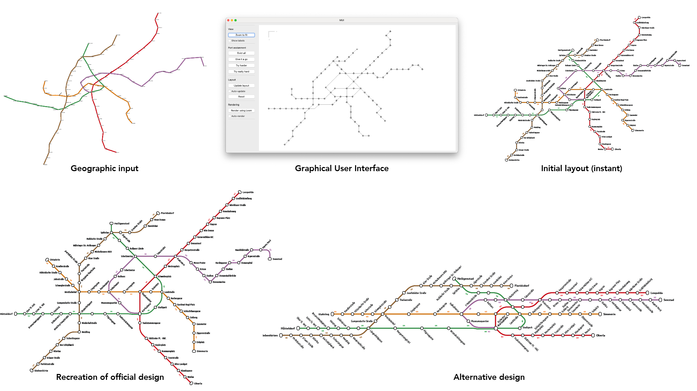

# Algorithmically-Assisted Schematic Transit Map Design: A System and Algorithmic Core for Fast Layout Iteration

Thomas C. van Dijk, Soeren Terziadis - TU Eindhoven




---

*Abstract* - [Demo video](https://youtu.be/JEC1Ym6qWeg)

London's famous "tube map" is an iconic piece of design and perhaps represents the schematic visualization style most well-known to the general public: its octolinear style has become the de facto standard for transit maps around the world.
Making a good schematic transit map is challenging and labour-intensive, and has attracted the attention of the optimization community.
Much of the literature has focused on mathematically defining an optimal drawing and algorithms to compute one.
However, achieving these "optimal" layouts is computationally challenging, often requiring multiple minutes of runtime.
Crucially, what it means for a map to be good is actually highly dependent on factors that evade a general formal definition, like unique landmarks within the network, the context in which a map will be displayed, and preference of the designer and client.
Rather than attempting to make an algorithm that produces a single high-quality and ready-to-use metro map, we propose it is more fruitful to support rapid layout iteration by a human designer, providing a workflow that enables efficient exploration of a wider range of designs than could be done by hand, and iterating on these designs.
To this end we identify steps in the design process of schematic maps that are tedious to do by hand but are algorithmically feasible and present a framework around a simple linear program that computes network layouts almost instantaneously given a fixed direction for every edge, and let the designer decide these directions.
These decisions are made in a graphical user interface with several interaction methods and a number of quality-of-life features demonstrating the flexibility of the framework; the implementation is available as open source.

---

## Installation

It is probably wise to make a virtual environment first.
Then install libraries (mostly `ortools`, `scipy`, `pyside6`) using the `pip` requirements file.

```pip install -r requirements.txt```

In order to render the map to SVG, you need to install [Loom](https://github.com/ad-freiburg/loom) so that `loom` and `transitmap` are available from the shell.

## Running

Initial startup of the GUI can take a while, so please be patient; run `splash.py`.